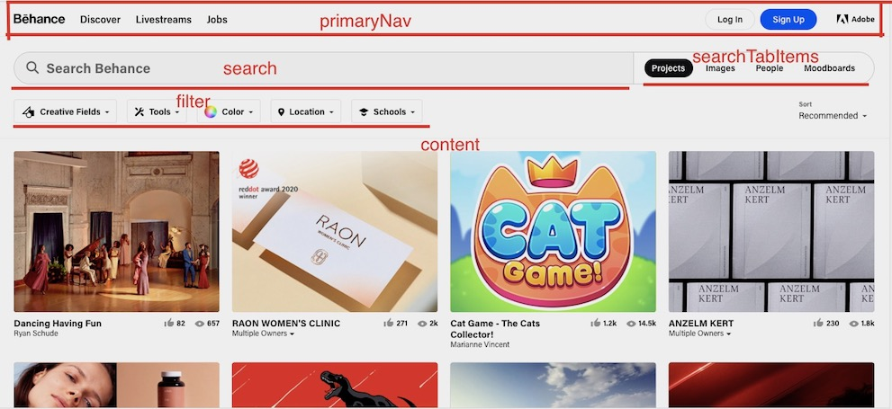
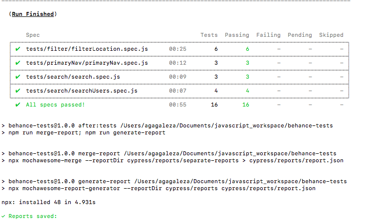
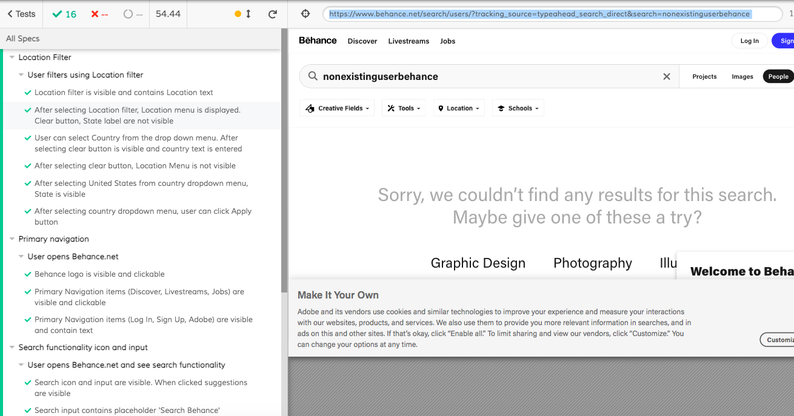
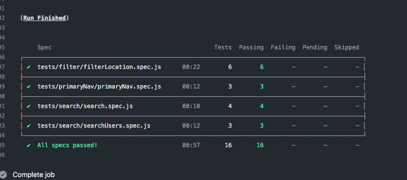
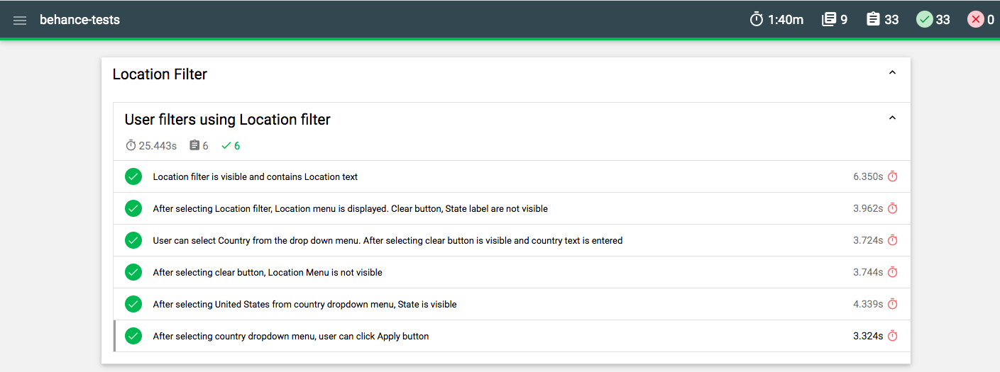

# behance-tests

# Application behance.net

Application is written using JS framework - Vue.js.
The goal is to write tests using POM.

# Test Framework and tests' organisation

1. Test framework chosen - **Cypress**
2. Tests are organised into folders:
   - elements/pages - contains POM classes
   - integration/tests - contains tests
   - logs
   - plugins
   - reports
   - screenshots
   - snapshots
   - support

# POM organisation

The following POM classes were separated for this tests:

Tests were written for the following functionalities: filter, filter Location, search, search user and primary navigation.

# Browsers

Tests were run using Chrome headless and Chrome browsers

# Environment setup

Node.js:

- https://nodejs.org/en/download/

npm:

- installing Node will also install npm

Git:

- [https://git-scm.com/book/en/v2/Getting-Started-Installing-Git](https://git-scm.com/book/en/v2/Getting-Started-Installing-Git)

Cypress:

- `npm install cypress --save-dev`

**Modules**

cypress cypress-failed-log:

- `npm install --save-dev cypress cypress-failed-log`

cypress-image-snapshot:

- `npm install --save-dev cypress-image-snapshot`

mochawesome, mochawesome-merge, mochawesome-report-generator

- `npm i --D mocha mochawesome mochawesome-merge mochawesome-report-generator`

prettier, pretty-quick

- `npm install --save-dev prettier pretty-quick`

Clone repository using `git clone` and run `npm install`

# How to run tests

1. `npm run cypress`

Tests run using Chrome headless. At the end report is generated.

2. `node_modules/.bin/cypress`

Run tests on Chrome

# Github Actions

Simple workflow (start-tests.yml) was set up to run tests on Chrome Headless

# Report and screenshots

Report.html is genarated using mochawesome, mochawesome-merge, mochawesome-report-generator modules and it's stored in the reports folder.

# Visual testing

Locally I was using a module - cypress-image-snapshot. Test was added in the filterLocation.spec.js. Snapshots folder contains images to compare.
Image comparison failed on github actions so code is commented out and need further investigation how (and if it's possible) to use this plugin with CI/CD.

# TODO

Vue developer tools are disable for production site. One of requests POST \log is failing. For Cypress - uncaught:exception was added to ignore this JS exceptions.
